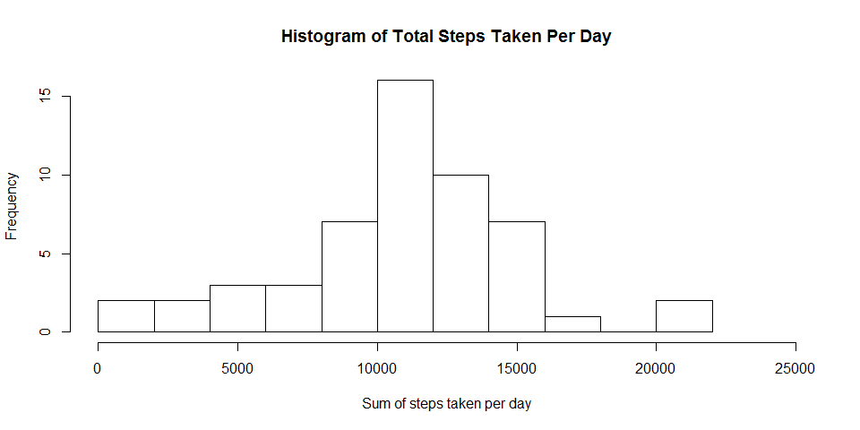
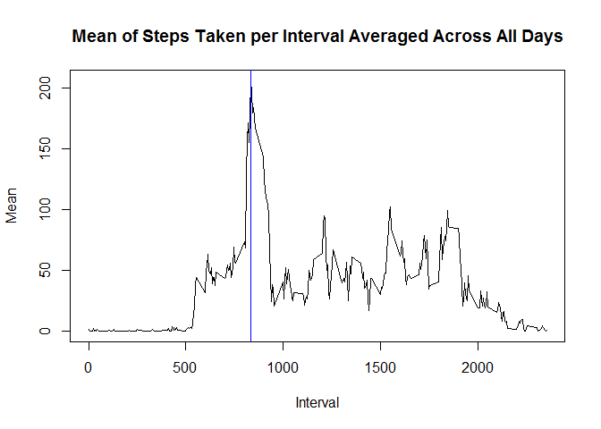
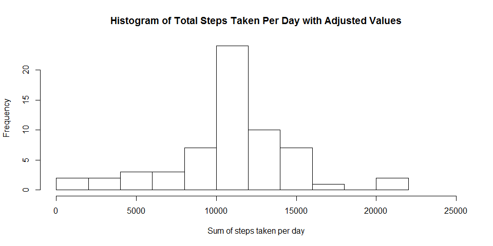
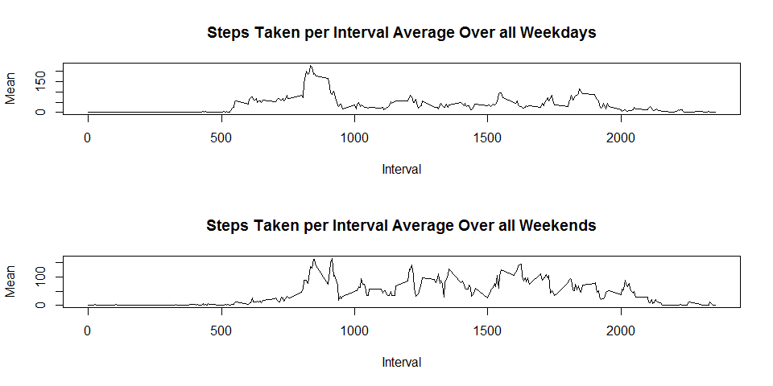

# Reproducible Research: Peer Assessment 1

First of all, I have set a global option to have all chunk echo = TRUE, warning = FALSE and message = FALSE so as to not clutter the document.


Next, the libraries that I used to complete the assignment is loaded.

```r
library(plyr)
library(dplyr)
library(ggplot2)
library(lattice)
library(lubridate)
```


## Loading and preprocessing the data
Firstly, the data is read and processed.The str(), head is shown for a better understanding on the data that we are working on.


```r
zipfile <- "activity.zip"
fileName <- "activity.csv"
if (!file.exists(fileName)){
    unzip(zipfile = zipfile)
}
data <- read.csv(fileName, stringsAsFactors = FALSE)
str(data)
```

```
## 'data.frame':	17568 obs. of  3 variables:
##  $ steps   : int  NA NA NA NA NA NA NA NA NA NA ...
##  $ date    : chr  "2012-10-01" "2012-10-01" "2012-10-01" "2012-10-01" ...
##  $ interval: int  0 5 10 15 20 25 30 35 40 45 ...
```

```r
head(data)
```

```
##   steps       date interval
## 1    NA 2012-10-01        0
## 2    NA 2012-10-01        5
## 3    NA 2012-10-01       10
## 4    NA 2012-10-01       15
## 5    NA 2012-10-01       20
## 6    NA 2012-10-01       25
```


## What is mean total number of steps taken per day?

To get the sum and mean of total number of steps taken per day, I will first use dplyr to organise and summarise the data. The first 10 rows will be shown to get an idea of the processed data, tabSum.

```r
tabSum <- data %>%
    group_by(date) %>%
    filter(complete.cases(steps)) %>%
    summarise(sum = sum(steps))
tabSum
```

```
## Source: local data frame [53 x 2]
## 
##          date   sum
## 1  2012-10-02   126
## 2  2012-10-03 11352
## 3  2012-10-04 12116
## 4  2012-10-05 13294
## 5  2012-10-06 15420
## 6  2012-10-07 11015
## 7  2012-10-09 12811
## 8  2012-10-10  9900
## 9  2012-10-11 10304
## 10 2012-10-12 17382
## ..        ...   ...
```

The histogram of the total number of steps taken per day will be plotted first.

```r
hist(tabSum$sum, breaks = 10,
     xlab = "Sum of steps taken per day",
     xlim = c(0,25000),
     main = "Histogram of Total Steps Taken Per Day")
```

 

Below is the the mean and median of the total number of steps taken per day.

```r
mean(tabSum$sum)
```

```
## [1] 10766.19
```

```r
median(tabSum$sum)
```

```
## [1] 10765
```


## What is the average daily activity pattern?

First, the data is processed using dplyr to filter complete cases, group by intervals, and taking the mean for each intervals over the days.


```r
tabInterval <- data %>%
    filter(complete.cases(steps)) %>%
    group_by(interval) %>%
    summarise(mean = mean(steps))
```

The processed data is then plotted using base plot system, as shown below with type = "l".


```r
plot(tabInterval$interval, y = tabInterval$mean,
      xlab = "Interval",
      ylab = "Mean",
      main = "Mean of Steps Taken per Interval Averaged Across All Days",
      type = "l")
abline( v = 835, col = "blue")
```

 

The interval value which has the highest mean number of steps is calculated as shown below.


```r
tabInterval[which.max(tabInterval$mean),1]
```

```
## Source: local data frame [1 x 1]
## 
##   interval
## 1      835
```

```r
tabInterval
```

```
## Source: local data frame [288 x 2]
## 
##    interval      mean
## 1         0 1.7169811
## 2         5 0.3396226
## 3        10 0.1320755
## 4        15 0.1509434
## 5        20 0.0754717
## 6        25 2.0943396
## 7        30 0.5283019
## 8        35 0.8679245
## 9        40 0.0000000
## 10       45 1.4716981
## ..      ...       ...
```

The interval is 835, which is shown by the blue vertical line in the plot above.


## Imputing missing values

Number of NAs in the dataset can be calculated by taking the difference between the length of the full dataset and the length of a dataset subsetted without the NA values.


```r
nrow(data) - nrow(data[complete.cases(data),])
```

```
## [1] 2304
```

To input the missing values, I will use dplyr to mutate a new column that takes an input of the mean value of the interval if the value of steps is NA for that interval. The value of the mean value of the interval is taken from the table, tabInterval.


```r
tabNAs <- data %>%
        mutate(adjustedSteps = ifelse(!is.na(steps), steps, tabInterval$mean[match(interval, tabInterval$interval)])) %>%
    select(-(steps))

tail(tabNAs)
```

```
##             date interval adjustedSteps
## 17563 2012-11-30     2330     2.6037736
## 17564 2012-11-30     2335     4.6981132
## 17565 2012-11-30     2340     3.3018868
## 17566 2012-11-30     2345     0.6415094
## 17567 2012-11-30     2350     0.2264151
## 17568 2012-11-30     2355     1.0754717
```

This is the head of the data where the steps are adjusted to the mean if the original value was NA.

Replotting the histogram now with the input of the average values.


```r
tabSumAdjusted <- tabNAs %>%
    group_by(date) %>%
    summarise(sum = sum(adjustedSteps))
tabSumAdjusted
```

```
## Source: local data frame [61 x 2]
## 
##          date      sum
## 1  2012-10-01 10766.19
## 2  2012-10-02   126.00
## 3  2012-10-03 11352.00
## 4  2012-10-04 12116.00
## 5  2012-10-05 13294.00
## 6  2012-10-06 15420.00
## 7  2012-10-07 11015.00
## 8  2012-10-08 10766.19
## 9  2012-10-09 12811.00
## 10 2012-10-10  9900.00
## ..        ...      ...
```

The histogram of the total number of steps taken per day will be plotted first.

```r
hist(tabSumAdjusted$sum, breaks = 10,
     xlab = "Sum of steps taken per day",
     xlim = c(0,25000),
     main = "Histogram of Total Steps Taken Per Day with Adjusted Values")
```

 


```r
mean(tabSumAdjusted$sum)
```

```
## [1] 10766.19
```

```r
median(tabSumAdjusted$sum)
```

```
## [1] 10766.19
```

The value do not change, since the mean value was used. However, the frequency sum on the histogram will now add up correctly to the number of days, ie. 61.


## Are there differences in activity patterns between weekdays and weekends?

To add a new factor of whether the date falls on a weekday or weekend, a package called lubridate is used.


```r
tabWeek <- tabNAs %>%
    mutate(Week = ifelse(wday(date) == 1 | wday(date) == 7, "weekend", "weekday")) %>%
    group_by(Week, interval) %>%
    summarise(mean = mean(adjustedSteps))
```


```r
tabWeekday <- tabWeek[tabWeek$Week == "weekday",]
tabWeekend <- tabWeek[tabWeek$Week == "weekend",]
par(mfrow=c(2,1))
plot(x = tabWeekday$interval, y = tabWeekday$mean,
     type = "l",
     xlab = "Interval",
     ylab = "Mean",
     main = "Steps Taken per Interval Average Over all Weekdays")
plot(x = tabWeekend$interval, y = tabWeekend$mean,
     type = "l",
     xlab = "Interval",
     ylab = "Mean",
     main = "Steps Taken per Interval Average Over all Weekends")
```

 
